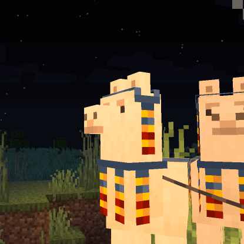

# OttCS
I have fun re-engineering the wheel, making and understanding "high performance" systems, and coding goofy ideas that come to me.

**My Pages** - [Random Writings](blog/README.md) - [Projects](projects/README.md)

# Fun Facts

* Director and Programmer for [Zephyr Studios](https://zephyrstudios.pages.dev/)
- Project lead for [ZephyrJS](https://github.com/ZephyrStudio/ZephyrJS/)
 
* TTRPG enjoyer
- Creator/maintainer of the beginner-friendly [SOLAS](https://github.com/OttCS/SOLAS) system
